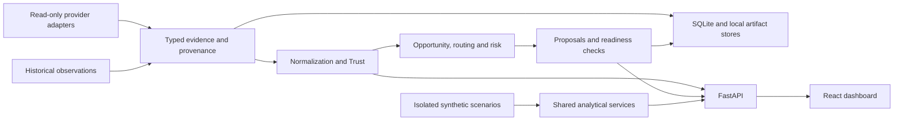

# Parity Pulse

**Clarity before exposure.** Parity Pulse is a tokenized-equity intelligence platform that compares tokenized stock representations with their underlying equities. It brings together independent evidence, share-ratio normalization, market-session context, provenance and risk checks to help explain a price difference before proposing exposure.

The application includes an interactive scenario dashboard and a separate provider/operations workspace. It supports analysis and non-executable proposals; **live SWAP, RFQ and Agentic Wallet execution remain blocked**.

## Why it exists

A tokenized stock can trade while its underlying equity market is closed. A price difference may reflect new information, stale quotes, thin liquidity, different issuer economics or a corporate action. Comparing two displayed prices without checking those conditions can give a misleading result.

Parity Pulse makes the evidence behind a comparison visible. Missing or conflicting evidence produces an explicit limitation or `INSUFFICIENT_EVIDENCE`, rather than a forced recommendation.

## What you can explore

- **Markets and representations:** discover supported underlying stocks and tokenized representations; inspect issuer metadata and read-only observations where providers support them.
- **Comparable exposure:** normalize token prices using verified shares-per-token ratios, calculate effective price per real share and compare deviations when compatible reference evidence exists.
- **Session-aware history:** distinguish regular, extended and closed markets; inspect captured historical equity bars without presenting them as current quotes.
- **Trust and evidence quality:** inspect freshness, source and ingestion times, liquidity evidence, news context, baseline coverage and reasons for classification or abstention.
- **Opportunities and routing:** evaluate deterministic eligibility, risk constraints and route economics. The scenario workspace demonstrates this flow; production Opportunity admission remains blocked by Trust evidence.
- **Portfolio and evaluation:** inspect exposure, target drift, position lifecycle, paper P&L, scorecards and decision traces. Scenario holdings are modeled values, not connected account balances.
- **Research:** vary explicitly labeled scenario assumptions and compare results; replay historical episodes only where point-in-time evidence supports them.
- **Preparation and dry runs:** review proposals, quote/preparation contracts, local demo simulation and readiness diagnostics. Synthetic simulation is not proof of executable mainnet equivalence.

Features share backend services, but their data availability differs. A working screen or service does not imply verified live inputs for every asset.

## How it works

1. Collect tokenized-asset, independent-equity and market-context evidence.
2. Validate source identity, timestamps, units, coverage and market-session compatibility.
3. Normalize comparable exposure and calculate price differences with exact decimal arithmetic.
4. Evaluate Trust, eligibility, route economics and risk constraints.
5. Present an assessment, a stand-down reason or a bounded, non-executable proposal with its evidence trail.

Backend deterministic logic owns financial calculations and safety decisions. Optional language-model adapters provide bounded interpretation; they cannot replace missing observations or authorize execution.



The synthetic scenario path does not populate production historical coverage or satisfy production gates.

## Technology

| Area | Implementation |
|---|---|
| Frontend | React, TypeScript, Vite, TanStack Query, Tailwind/CSS, Lucide icons |
| Visuals | Custom SVG charts, Three.js/WebGL paper scene with static fallback, GSAP route transitions |
| Backend | Python 3.12+, FastAPI, Pydantic, HTTPX |
| Persistence | SQLAlchemy with SQLite; local JSON journals and artifact stores for analytical/lifecycle workflows |
| Provider adapters | Binance Web3/RWA market data; Massive equity/news; explicitly selected Alpaca equity data; optional Finnhub event/calendar research context |
| Interfaces | HTTP APIs and an optional MCP stdio bridge over allowlisted analytical/proposal tools |
| Verification | pytest, Vitest, Testing Library, Ruff, generated-schema checks, security checks and a Chromium browser harness |

Twelve Data, GeckoTerminal and Hyperliquid investigation scripts are diagnostics, not automatically admitted production Trust references or liquidity sources.

## Getting started

Requirements: **Python 3.12+** and **Node.js 22.12+**. Run these commands from the repository root:

```sh
python3 -m venv .venv
.venv/bin/python -m pip install -r requirements-dev.txt
npm ci
```

Use [.env.example](.env.example) as the configuration template. If `.env` does not exist, copy the template to `.env`; preserve any existing local configuration. Provider credentials are optional for the default scenario experience and must stay in the ignored local environment, never frontend variables or Git.

Keep these settings for non-live use:

```dotenv
DATA_MODE=DEMO
EXECUTION_MODE=DRY_RUN
APPROVAL_MODE=PROPOSE_ONLY
LIVE_TRADING_ENABLED=false
REQUIRE_SIMULATION=true
```

`RUNTIME_MODE=LIVE` names the ordinary backend runtime; it does **not** enable trading. `RUNTIME_MODE=DEMO` requires `DATA_MODE=DEMO` and uses isolated in-memory stores for the explicit demo pipeline.

Start FastAPI in one terminal:

```sh
.venv/bin/python -m uvicorn app.main:create_app --factory \
  --app-dir backend --host 127.0.0.1 --port 8000 --no-access-log
```

Start Vite in another terminal, also from the repository root:

```sh
npm run dev
```

Open [http://127.0.0.1:5173/](http://127.0.0.1:5173/). Scroll past the interactive paper entrance to enter the scenario dashboard. Reduced motion or unavailable WebGL uses a static branded fallback. Vite proxies `/api` to the backend on port 8000.

The dashboard includes Overview, Markets, Trust & Signals, Opportunities, Portfolio, Research Lab and Scorecard. Its default prices, holdings, fictional Atlas/Meridian representations and evaluation outcomes are explicitly modeled scenario data.

The separate provider/operations workspace is available at [http://127.0.0.1:5173/?workspace=verified#overview](http://127.0.0.1:5173/?workspace=verified#overview). The URL selects that interface; it does not certify provider data. Read-only real-provider access requires `DATA_MODE=LIVE_READ_ONLY` and the relevant credentials/feed configuration in `.env.example`. The equity provider must be selected explicitly; unavailable reads do not silently fall back to synthetic data.

For the explicit demo pipeline, replace the backend command with:

```sh
RUNTIME_MODE=DEMO DATA_MODE=DEMO .venv/bin/python -m uvicorn \
  app.main:create_app --factory --app-dir backend \
  --host 127.0.0.1 --port 8000 --no-access-log
```

Then open [http://127.0.0.1:5173/?workspace=verified#demo-sandbox](http://127.0.0.1:5173/?workspace=verified#demo-sandbox). NORMAL and LIKELY_NOISE demonstrate stand-down paths; LIKELY_INFORMATION can proceed through supported opportunity, risk, routing, synthetic quote/preparation, local simulation and paper position/exit/P&L stages. No funds move, and the paper state clears on restart.

Backend health is available at `/api/health`; configuration and gate status are available at `/api/system-status`.

## Development checks

Run from the repository root:

```sh
npm test
npm run build
.venv/bin/python -m pytest -q
.venv/bin/python -m ruff check backend scripts
PYTHONPATH=backend .venv/bin/python scripts/generate-ui-contracts.py --check
.venv/bin/python scripts/check-security.py
```

`npm run build` includes TypeScript checking. The security check inspects local configured-secret leakage and frontend isolation without printing credentials.

For browser journeys, build first, then run:

```sh
.venv/bin/python scripts/verify-frontend-phase15.py
```

This requires local Google Chrome and free ports 8054–8057 and 5178. It uses disposable credential-free fixture backends, retains screenshots in a temporary directory and stops only its own processes. `--landing-only` restricts it to landing-page checks.

## Data and execution boundaries

- **Provider observations** retain source identity, observation/publication time, retrieval time and quality status. Credentials, feed entitlements and coverage determine what is available.
- **Historical observations** remain historical. The bundled Alpaca NVDA/AAPL display capture is separate from modeled token economics and is not a current-equity reference.
- **Synthetic fixtures and scenario values** are labeled and isolated. Their liquidity, holdings, prices and outcomes are not verified market data or predictive performance.
- **Independent references matter.** Binance `referencePrice` is not substituted for an independent traditional-equity quote. A stale quote or an unknown historical share ratio cannot be treated as current or known as-of evidence.

Current production gates:

| Gate | Status |
|---|---|
| DATA_GATE | PASS |
| DRY_RUN_GATE | PASS |
| TRUST_GATE | BLOCKED |
| OPPORTUNITY_GATE | BLOCKED_BY_TRUST |
| SWAP_LIVE_GATE | BLOCKED |
| RFQ_LIVE_GATE | BLOCKED |
| AGENTIC_WALLET_LIVE_GATE | BLOCKED |

Trust still requires admitted independent references, authoritative liquidity and qualifying point-in-time history, including the existing 30 baseline / 30 opening-model / 3 analogue safeguards in their applicable scopes. Event ingestion or synthetic demonstrations do not resolve those requirements.

Execution interfaces and offline safety tests exist, but live swap, RFQ and Agentic Wallet readiness is not established. Startup rejects live trading configuration. A passing test suite, a prepared payload or a local simulation does not establish production trading readiness or unlock any gate.

## Deployment

The included [Compose configuration](compose.yaml) builds the Python backend and serves the Vite production bundle through unprivileged nginx. nginx forwards `/api` to FastAPI; a named volume persists SQLite data. Both published ports bind to loopback.

```sh
docker compose up --build
```

Open [http://127.0.0.1:8080/](http://127.0.0.1:8080/). Keep the backend reachable by the frontend proxy and retain durable writable storage for ordinary lifecycle records. The backend image currently includes `data/demo`, but not the separate `data/display` history capture; those charts report unavailable when that capture is absent.

This is a local non-live deployment configuration. Docker build/run verification is not established here; remote authenticated execution deployment is not provided. `.dockerignore` excludes local credentials, and deployment configuration must retain the same execution restrictions.

## Fixtures and identification assets

JSON fixtures remain under [backend/tests/fixtures](backend/tests/fixtures). Provider captures are sanitized and their manifest records hashes; numeric money values are canonical decimal strings rather than byte-identical raw responses. Finnhub fixtures are synthetic protocol inputs, not real events or qualifying Trust evidence. Tests use fixed clocks, mocked transports and isolated stores.

Bundled company/issuer identification assets are served locally. [Brand provenance](frontend/public/brands/provenance.json) records original source URLs and hashes. These proprietary identifiers imply neither endorsement nor a redistribution license; fictional scenario issuers use labeled initials. Public/commercial redistribution rights have not been established by this repository.

The Agent Studio sidecar remains in the source tree but is not a verified or enabled execution path. It is not needed to run the dashboard.
