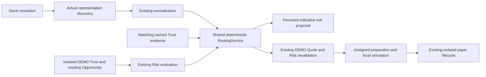

# Deterministic routing milestone

Status: **PASS for the implemented non-live routing scope**, verified 2026-10-07. This is one routing milestone; it advances no production Trust, Opportunity or execution gate. No commit was made.

## Audit and integration point

The existing Ask Flow already resolved stocks, discovered representations, validated identities and token/share ratios, normalized effective share cost, and persisted indicative proposals. Its final selection was an inline minimum of price-per-share. The existing DEMO runtime already had Trust, Opportunity, Risk, Quote, preparation, local simulation and paper lifecycle services. Those core engines and synthetic fixtures remain unchanged.

The new shared `RoutingService` replaces that inline selection with explicit, auditable eligibility and ranking. It receives all discovered representations after existing normalization. It has no provider client, wallet, execution transport, LLM, database or DEMO-specific selection branch. Boundary adapters supply mode-scoped, verified facts or explicit unavailable states; both application paths instantiate the same service class.



`POST /api/exposure/quote` remains the existing public integration point; no new API or execution endpoint is added. Its response includes `route_decision`. Existing stored proposals without that field remain readable. New decisions are persisted in the existing mode-isolated proposal payload. Expired retrieval returns `NO_ROUTE`, removes selection/ranks, and exposes rejection `ROUTE_EXPIRED`; the originally stored audit record is retained.

`RoutingEvidenceReader` reads only existing, recent, same-mode Trust assessments. The adapter accepts a representation only when ticker, issuer, chain, contract, symbol, token price and ratio match, and token timestamps align within 30 seconds. It does not create observations or call Trust/providers. Liquidity comes only from the existing normalized, sourced USD liquidity contract. Incomplete evidence remains unknown.

The DEMO Opportunity adapter evaluates the existing Opportunity and Risk engines, supplies their exact results to the shared router, and suppresses an otherwise actionable candidate when no route qualifies. The Quote adapter re-evaluates routing with current inputs before the existing Quote/Risk/preparation guards. No hardcoded classification-to-opportunity rule was added. Existing sandbox scenarios each contain one representation; this integration uses that supplied representation without inventing competitors. Multi-representation routing is exercised separately through the actual discovery/normalization composition tests.

Production inputs are supported through the real `LIVE_READ_ONLY` Ask discovery path. The production Opportunity gate still blocks the production downstream trading workflow. The current downstream adapter is synthetic DEMO only; this milestone does not claim a verified live vendor quote, transaction, simulation or production Opportunity adapter.

## RouteDecision contract

`backend/app/models/routing.py` defines strict, frozen financial contracts:

- Underlying, notional, data mode, UTC evaluation time, validity deadline and stable decision ID.
- Selected representation/issuer and selected candidate, or null selection for `NO_ROUTE`.
- All candidates with identities, normalized prices/ratios, source timestamps, provenance, eligibility, rejection reasons, limitations and rank.
- Effective USD cost per real share, estimated USD additional costs, all-in estimate when available and the exact comparison basis.
- Liquidity state, Trust evidence/state, Risk evidence/constraints and tradability.
- Explicit versioned policy, ranking inputs and deterministic explanation.
- `execution_mode=DRY_RUN`, `execution_ready=false`, `transaction_broadcast=false`, no provider execution mode and an explicit no-broadcast statement.

Selection must equal the eligible rank-one candidate. Financial inputs reject floats, non-finite/negative amounts, nonpositive prices/ratios and out-of-bound values. Mode/underlying and conflicting contract identities fail closed. Stable IDs derive from canonical input/policy/time fingerprints; reordered candidates produce the same decision.

## Eligibility and policy

Filters always run before ranking. Both policies reject unsupported or invalid normalization, missing token prices, explicitly unavailable routes, paused/closed/unknown/untradable representations, conflicting contract labels, mixed underlying/mode, known insufficient/zero liquidity, known failed Risk or notional limits, and known `LIKELY_NOISE`. Tradability is restricted to supported `regular`, `premarket` or `postmarket` states; unsupported overnight routing abstains.

LIVE analytical inputs must have LIVE-quality prices, source price timestamps and observed ratios younger than 120 seconds, with no future timestamps. DEMO identities or synthetic preparation cannot enter LIVE routing. Synthetic frozen price fixtures are valid only in DEMO. Current ratio metadata is not historical as-of evidence.

| Policy | Required evidence | Behavior when unavailable |
|---|---|---|
| `INDICATIVE_EXPOSURE` | Existing normalization, supported/tradable representation and current LIVE price/ratio where applicable | Unavailable costs/liquidity/Trust/Risk remain explicitly unknown; selection is an estimate, never executable |
| `OPPORTUNITY` | All costs, verified USD liquidity, current qualifying Trust, current passing Risk/cap and a supported analytical route | Reject; no price-only fallback |

The Opportunity adapter obtains minimum liquidity and maximum slippage from the **existing Risk policy**, unchanged. It requires every control; callers cannot disable them in an Opportunity policy. Qualifying Trust is `LIKELY_INFORMATION`; `NORMAL` does not create an Opportunity. Known Risk failure always rejects. Required evidence must have source, timestamp and identity/assessment references where applicable, and be younger than 120 seconds. A route advertised as available but marked `INDICATIVE_ONLY` cannot satisfy Opportunity routing.

Policy version: `routing-1`. Ranking: `MIN_EXACT_EFFECTIVE_COST_THEN_IDENTITY`. **No weights are used.** The public Ask request contains only stock text; caller-supplied policy/execution fields are rejected. Query overrides, including `?execute=true`, return 404.

## Economics and ranking

Let `P` be USD/token, `R` real shares/token, `B` requested USD mark notional before costs, `s` estimated slippage in basis points, `F` fees in USD and `G` gas in USD.

```text
effective share cost = P / R
estimated additional USD costs = B × s / 10,000 + F + G
all-in estimated share cost = (P / R) × (1 + s / 10,000 + (F + G) / B)
```

When all eligible candidates have complete, sourced and current costs, rank by the exact all-in estimate. Otherwise the indicative policy ranks **every eligible candidate on the same token-price-only basis** and explicitly reports `TOKEN_PRICE_ONLY`; missing costs remain null. It never treats missing fees/slippage as zero or mixes all-in and base-price scores. Strict Opportunity policy rejects missing costs first.

Ranking uses exact rational arithmetic, avoiding rounding-driven winners. Display values round upward to 18 decimal places. Equal exact costs use the explicit issuer/chain/contract/token identity tie-break, independent of discovery ordering. No ticker/issuer preference is encoded. Execution reserves are Risk buffers, not paid costs; existing Risk sizing and paper cost accounting remain unchanged.

Example verified by automated tests; these are **synthetic test inputs, not market observations**. Both candidates meet identical eligibility requirements, `R=1`, `G=0`, `s=0`, requested `B=$50`:

| Issuer | Token price | Fees | Base cost/share | All-in cost/share | Decision |
|---|---:|---:|---:|---:|---|
| issuer-a | $50.00 | $1.00 | $50.00 | $51.00 | Rank 2 |
| issuer-b | $50.50 | $0.00 | $50.50 | $50.50 | Selected |

With the same inputs and `B=$200`, issuer-a costs $50.25/share and becomes selected. A token priced at $250 with two shares/token has base exposure cost $125/share and beats a $130 one-share token when other constraints match. Cheaper paused, low-liquidity, failed-Trust or failed-Risk candidates never enter ranking.

Decisions expire after at most 30 seconds, shortened by required evidence deadlines. They are analysis snapshots, never durable permission to trade.

## UI and scenario behavior

The existing Ask, DEMO Opportunity and DEMO Quote views reuse `RouteComparison`. It shows issuer/token, effective share cost, liquidity, fees/gas, slippage, Trust, tradability, rank/selection/rejection, explanation, policy and expandable provenance. Unavailable values are labeled. DEMO is visibly synthetic; LIVE analytical results remain read-only. Tables scroll locally on mobile without page overflow.

| Scenario | Trust | Opportunity | Route | Downstream |
|---|---|---|---|---|
| NORMAL | NORMAL | NO_OPPORTUNITY | NO_ROUTE | No quote or paper action |
| LIKELY_NOISE | LIKELY_NOISE | REJECTED_BY_TRUST | NO_ROUTE | No quote or paper action |
| LIKELY_INFORMATION | LIKELY_INFORMATION | ACTIONABLE when existing rules permit | ROUTE_SELECTED | Existing synthetic quote, preparation, local simulation, paper position/exit/P&L/scorecard |

Frontend validation checks mode/underlying/notional bindings, required policy controls, financial formats, candidate ranking/selection consistency and blocked execution flags. Legacy responses without routing remain compatible.

## Verification

- **510 backend tests PASS**: all 467 pre-existing tests retained, plus 43 new routing tests (30 deterministic rules, 7 cached-evidence tests, 6 API/composition tests).
- **165 frontend tests PASS**: all 146 pre-existing tests retained, plus 19 routing contract/view tests.
- TypeScript `--noEmit` and Vite production build PASS; Ruff check and format check PASS.
- Established security audit and extended eight-provider-secret audit PASS. Secrets are inspected only in memory; no value is recorded.
- Actual built-app desktop (1440px) and mobile (390px) browser checks PASS: Ask selection, unsupported `NO_ROUTE`, all three sandbox scenarios, route provenance, quote/preparation/simulation and complete paper lifecycle; no runtime errors or page overflow. All 41 allowlisted local API responses succeeded; zero external provider or live execution calls.
- Saved byte hashes verify unchanged production gates, core Trust/Opportunity/Risk/Quote/simulation/paper engines, existing fixtures/tests/reports, scheduled alignment diagnostic and all eight existing database files. Historical row counts remain unchanged. Test databases and browser sandbox ledgers are isolated/disposable.
- The existing FastAPI/Starlette test-client deprecation warning remains; tests pass. No dependency change was introduced.

LIVE_READ_ONLY composition tests use explicitly labeled offline provider doubles. They verify discovery-to-routing architecture and separation, **not** current provider access, market economics, liquidity authority or live entitlement. This milestone makes no new provider claim. [Machine verification](evidence/ROUTING_VERIFICATION.json) and [browser evidence](evidence/ROUTING_BROWSER.json) record the measured scope.

## Files changed

Modified:

- `README.md`
- `backend/app/api/exposure.py`
- `backend/app/models/demo_execution.py`
- `backend/app/models/demo_opportunity.py`
- `backend/app/models/exposure.py`
- `backend/app/repositories/exposure.py`
- `backend/app/services/demo_opportunity.py`
- `backend/app/services/demo_preparation.py`
- `backend/app/services/exposure.py`
- `frontend/src/components/AskFlow.tsx`
- `frontend/src/components/DemoOpportunityFlow.tsx`
- `frontend/src/components/DemoPreparationFlow.tsx`
- `frontend/src/services/demoOpportunity.ts`
- `frontend/src/services/demoPreparation.ts`
- `frontend/src/services/exposure.ts`
- `frontend/src/styles.css`

Created:

- `backend/app/models/routing.py`
- `backend/app/services/routing.py`
- `backend/app/services/route_inputs.py`
- `backend/app/services/routing_evidence.py`
- `backend/tests/unit/test_routing.py`
- `backend/tests/unit/test_routing_evidence.py`
- `backend/tests/integration/test_routing_api.py`
- `frontend/src/services/routing.ts`
- `frontend/src/components/RouteComparison.tsx`
- `frontend/src/test/Routing.test.tsx`
- `frontend/src/test/routingFixtures.json`
- `docs/ROUTING_MILESTONE.md`
- `docs/evidence/ROUTING_VERIFICATION.json`
- `docs/evidence/ROUTING_BROWSER.json`

## Safety and remaining blockers

```text
DATA_GATE=PASS
DRY_RUN_GATE=PASS
TRUST_GATE=BLOCKED
OPPORTUNITY_GATE=BLOCKED_BY_TRUST
SWAP_LIVE_GATE=BLOCKED
RFQ_LIVE_GATE=BLOCKED
AGENTIC_WALLET_LIVE_GATE=BLOCKED
```

Production gate semantics, thresholds, 30/30/3 requirements, simulation/equivalence, confirmation, wallet restrictions and fail-closed controls are unchanged. There is no signer, broadcast, RFQ order submission or execution path in the router. Provider `executionMode` is not guessed from issuer identity. No external provider or scheduled market-alignment test was run. No production historical data was added.

Current-independent-equity entitlement/alignment verification, authoritative liquidity, historical as-of ratios and qualifying real 30/30/3 evidence remain unresolved. Missing real costs/slippage and executable-route authority remain explicit in actual discovery results. Future production downstream integration requires passing its existing gates and verified, representation-bound quotes/preparation/simulation; SWAP execution/simulation equivalence, RFQ settlement equivalence and Agentic Wallet runtime remain unverified. Synthetic local simulation and paper execution do not resolve them.

Automatic approval review rejected changing a newly added execution-query test from expected 404 to 200. The test was retained and the existing proposal endpoint now rejects query overrides instead. All pre-existing tests remain unchanged.

STOP after routing. No next feature stage was implemented and no commit was made.
